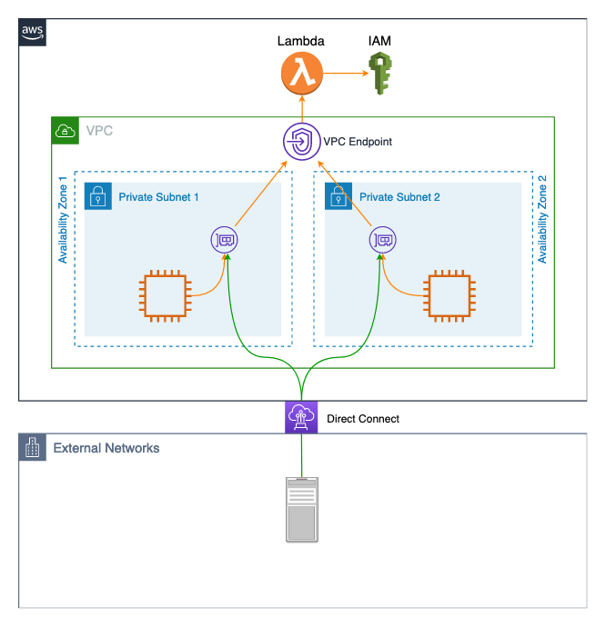

# Automate Rotation of IAM User Access Key Credentials using AWS Lambda

## Overview 

This project provides an implementation of a Lambda function which can be invoked from within
a VPC in order to rotate access key credentials (`Access Key ID` and `Secret Access Key`) 
associated with an IAM User. It utilizes VPC Endpoint powered by AWS PrivateLink to provide
secure access to Lambda function without need for Internet access. Moreover, if accessed
from within a VPC, data traffic never leaves AWS network. 

## Diagram



## Installation

Follow these steps to get up and running with a fully working environment: 

### 1. Prerequisite software tools and AWS account setup

Before you can start working with Terraform code provided here, you must have a few 
software tools installed on your local workstation or build server. These are:

- [Git](https://git-scm.com/book/en/v2/Getting-Started-Installing-Git)
- [Terraform CLI](https://learn.hashicorp.com/tutorials/terraform/install-cli) 
- [AWS CLI](https://docs.aws.amazon.com/cli/latest/userguide/install-cliv2.html)

You will also need an AWS account ([signup here](https://aws.amazon.com/free/free-tier/) 
for a free tier account if you don't already have one). 

Finally, in order to test your Lambda function, you will need an EC2 instance or a machine 
connected to AWS through Direct Connect or VPN. This EC2 instance or machine must have AWS 
CLI configured to access your AWS account. 

> :information_source: If you're new to AWS CLI, you can follow the quickstart 
[steps here](https://docs.aws.amazon.com/cli/latest/userguide/cli-configure-quickstart.html). 
Creating a [named profile](https://docs.aws.amazon.com/cli/latest/userguide/cli-configure-profiles.html) 
is recommended for Terraform use. 

> :information_source: As an alternative to using AWS CLI, you could also invoke the Lambda
function using AWS SDK from a code written in languages such as Java, Node.js or Python. 

### 2. Clone this repo

Open a Terminal, and run the following command from a directory where you want to download 
the Github repo code: 

`git clone git@github.com:asksac/RotateIAMUserCreds.git`

> :information_source: There are several ways of cloning a Github.com repo. For more details, 
refer to [this page](https://docs.github.com/en/free-pro-team@latest/github/creating-cloning-and-archiving-repositories/cloning-a-repository)

### 3. Customize variable values 

The [Terraform module](./docs/MODULE.md) in this project defines several input variables 
that must be set based on your environment before you can apply the Terraform configuration. 
You may set input values using a `module` configuration block from your own Terraform 
project. Or, you may run this project as a root module directly, and set input values in 
a file named `terraform.tfvars` in the project's root directory. An example `terraform.tfvars` 
might look like this: 

```
app_name               = "RotateUserAccessKey"
app_shortcode          = "RotateUAK"
aws_env                = "Dev"
aws_profile            = "default"
aws_region             = "us-east-1"
iam_user_name          = "myuser"
principal_arn          = "arn:aws:iam::012345678910:role/MyDevOpsRole"
source_cidr_blocks     = [ "200.20.2.0/24" ]
subnet_ids             = [ "subnet-a1b2c3d4", "subnet-e5f6a7b8", "subnet-c9d0e1f2" ]
vpc_id                 = "vpc-f0e1d2c3b4"
```

*For your testing, make sure to change above values based on your environment setup. 

### 4. Apply Terraform configuration

You're now ready for installation, which is to deploy the Terraform configuration. Run the 
following commands in a Terminal from the project root directory:

```shell
terraform init
terraform apply
```

Second command above will first run _plan_ phase of Terraform, and output a list of 
resources that Terraform will create. After verifying, enter `yes` to proceed with resource 
creation. This step may take a few minutes to complete. At the end, it will output a couple of  
configuration values that must be noted for testing and validation steps (next section). 

## 5. Testing the Lambda

Assuming Terraform configuration in the last step above completes successfully, you will 
now have a Lambda function and a VPC endpoint for Lambda deployed within your specified 
VPC. If you have an EC2 instance deployed in that VPC, you may invoke your newly created 
Lambda function through the VPC endpoint for Lambda. Run the following command to invoke 
Lambda and capture the output in a file named here as `response.json`: 

(make sure to replace `<enter_endpoint_dns_name_here>` with output value from step 4)

```shell
aws lambda invoke --function-name RotateIAMUserCreds \
  --payload '{"AccessKeyMinAgeInDays": "30"}' \
  --cli-binary-format raw-in-base64-out \
  --endpoint-url https://<enter_endpoint_dns_name_here> \
  response.json 

cat response.json 
```

The output captured in `response.json` should resemble something like this: 

```json
{
    "StatusCode": 200,
    "ExecutedVersion": "$LATEST"
}
{"statusCode": 200, "body": {"NewKeys": "[]", "ActiveKeys": [{"UserName": "myuser", "AccessKeyId": "A9Z8B7Y6C5X4D3W2E1", "KeyAgeInDays": 18, "Status": "Active"}]}}
```

## License

[](http://badges.mit-license.org)

- **[MIT license](http://opensource.org/licenses/mit-license.php)**
- Copyright 2020 &copy; Sachin Hamirwasia
